# Chat Persistence Architecture Diagrams

**Epic E9 - Chat Persistence**
**Version:** 1.0

This document contains Mermaid diagrams visualizing the Chat Persistence architecture.

---

## Table of Contents

1. [Database Schema (ER Diagram)](#database-schema-er-diagram)
2. [Message Flow (Sequence Diagram)](#message-flow-sequence-diagram)
3. [Component Architecture (System Diagram)](#component-architecture-system-diagram)
4. [Dual Storage Architecture](#dual-storage-architecture)
5. [Conversation Lifecycle State Machine](#conversation-lifecycle-state-machine)
6. [Multi-Channel Routing](#multi-channel-routing)

---

## Database Schema (ER Diagram)

This diagram shows the relationships between PostgreSQL tables.

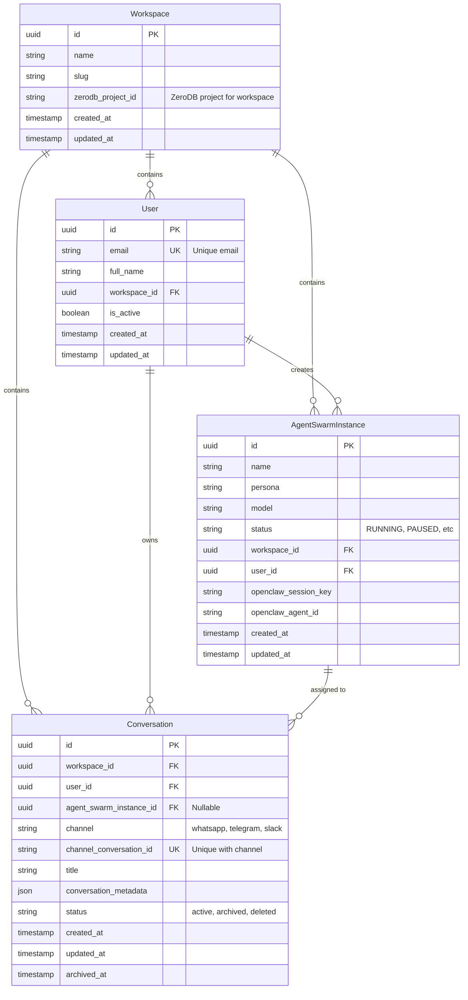

**Key Relationships**:
- **Workspace → User**: One-to-many (CASCADE delete)
- **Workspace → AgentSwarmInstance**: One-to-many (CASCADE delete)
- **Workspace → Conversation**: One-to-many (CASCADE delete)
- **User → Conversation**: One-to-many (CASCADE delete)
- **AgentSwarmInstance → Conversation**: One-to-many (SET NULL on delete)

**Unique Constraints**:
- `User.email` - Globally unique
- `Conversation(channel, channel_conversation_id)` - Prevents duplicate channel conversations

---

## Message Flow (Sequence Diagram)

This diagram shows the complete flow from WhatsApp message to ZeroDB storage.

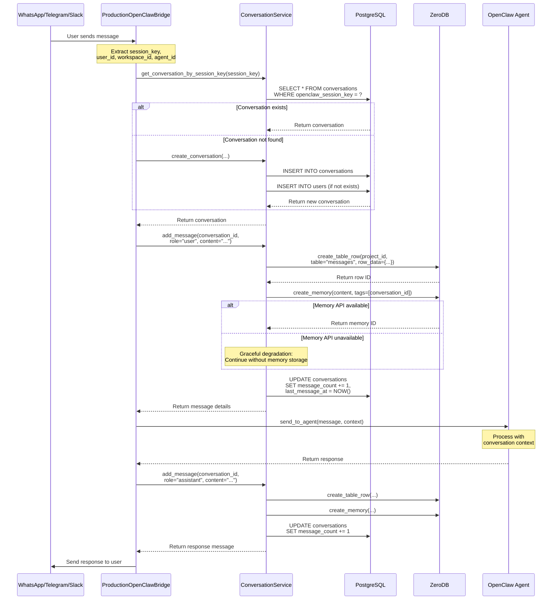

**Key Steps**:
1. User sends message via channel (WhatsApp, Telegram, etc.)
2. Bridge finds or creates conversation
3. User message persisted to ZeroDB (table + memory)
4. Conversation metadata updated in PostgreSQL
5. Message sent to agent for processing
6. Agent response persisted to ZeroDB
7. Response sent back to user via channel

---

## Component Architecture (System Diagram)

This diagram shows the high-level system architecture and data flow.

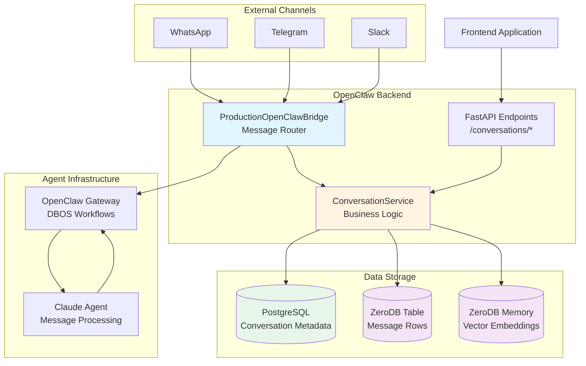

**Component Responsibilities**:

- **ProductionOpenClawBridge**: Routes messages from channels to agents, manages conversation persistence
- **ConversationService**: Business logic for conversation and message management
- **FastAPI Endpoints**: REST API for frontend access
- **PostgreSQL**: Stores conversation metadata (workspace, user, agent, status, counts)
- **ZeroDB Table**: Stores message content for chronological retrieval
- **ZeroDB Memory**: Stores message embeddings for semantic search
- **OpenClaw Gateway**: DBOS-backed workflow orchestration
- **Claude Agent**: Processes messages with conversation context

---

## Dual Storage Architecture

This diagram explains the dual storage model for messages.

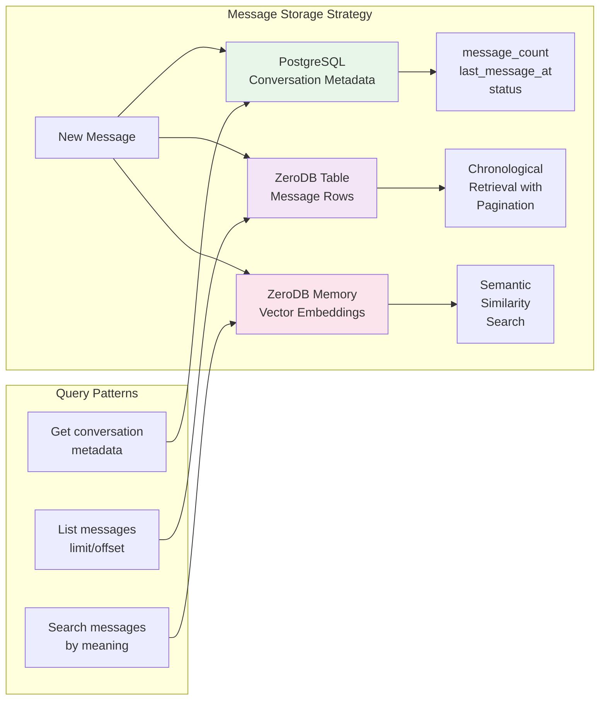

**Storage Breakdown**:

| Storage | Purpose | Data | Query Type |
|---------|---------|------|------------|
| PostgreSQL | Metadata | workspace_id, user_id, agent_id, message_count, timestamps | Structured queries, filtering, joins |
| ZeroDB Table | Message rows | conversation_id, role, content, timestamp, metadata | Pagination (limit/offset), chronological order |
| ZeroDB Memory | Embeddings | Message content as vectors, conversation_id tags | Semantic similarity search |

**Why Dual Storage?**

1. **Performance**: PostgreSQL optimized for metadata queries, ZeroDB for message content
2. **Scalability**: ZeroDB handles high-volume message storage, PostgreSQL for relationships
3. **Flexibility**: Table for pagination, Memory for semantic search
4. **Reliability**: Graceful degradation if Memory API fails (table storage continues)

---

## Conversation Lifecycle State Machine

This diagram shows the conversation status transitions.

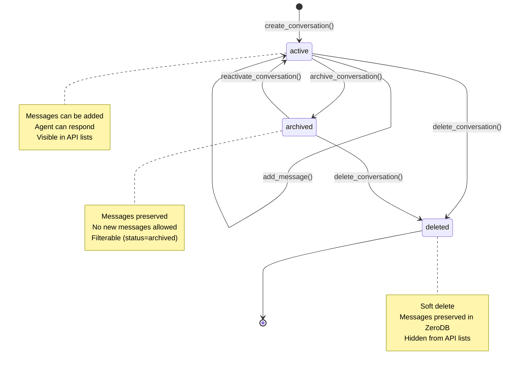

**Status Definitions**:

- **active**: Conversation is ongoing, messages can be added
- **archived**: Conversation is archived (user completed task, no longer active)
- **deleted**: Soft-deleted conversation (hidden from UI, data preserved for compliance)

**Allowed Transitions**:
- `active → archived`: User archives conversation
- `archived → active`: User reactivates conversation
- `active → deleted`: User or admin deletes conversation
- `archived → deleted`: User or admin deletes archived conversation

---

## Multi-Channel Routing

This diagram shows how messages from different channels are routed to conversations.

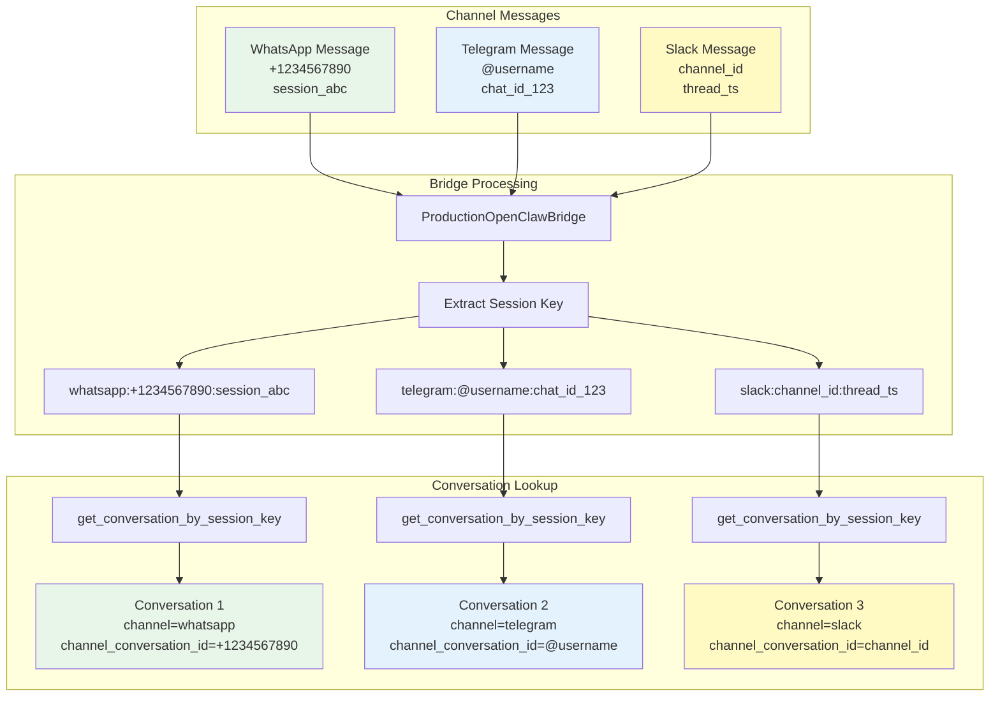

**Session Key Format**:
```
{channel}:{channel_identifier}:{session_id}
```

Examples:
- WhatsApp: `whatsapp:+1234567890:session_abc`
- Telegram: `telegram:@username:chat_id_123`
- Slack: `slack:channel_id:thread_ts`

**Unique Constraint**:
```sql
UNIQUE (channel, channel_conversation_id)
```

This prevents duplicate conversations for the same channel identifier.

---

## Context Loading Flow

This diagram shows how agents load conversation history for context.

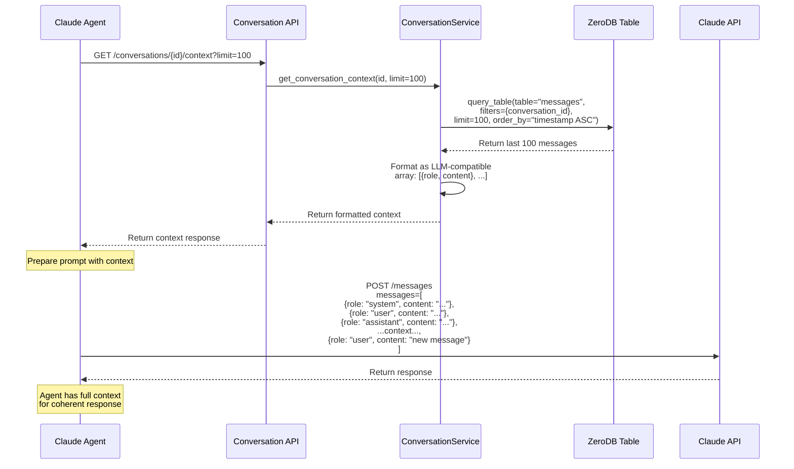

**Context Window Management**:

- **Default**: Load last 100 messages
- **Configurable**: `limit` parameter (1-1000)
- **Optimization**: Only load what fits in LLM context window
- **Caching**: Consider caching context for active conversations

**Example Context Response**:
```json
{
  "conversation_id": "123e4567...",
  "messages": [
    {"role": "user", "content": "Hello"},
    {"role": "assistant", "content": "Hi! How can I help?"},
    {"role": "user", "content": "What's the weather?"}
  ],
  "total_messages": 3,
  "agent_id": "456e4567...",
  "metadata": {"model": "claude-3-5-sonnet-20241022"}
}
```

---

## Semantic Search Flow

This diagram shows how semantic search works across conversation messages.

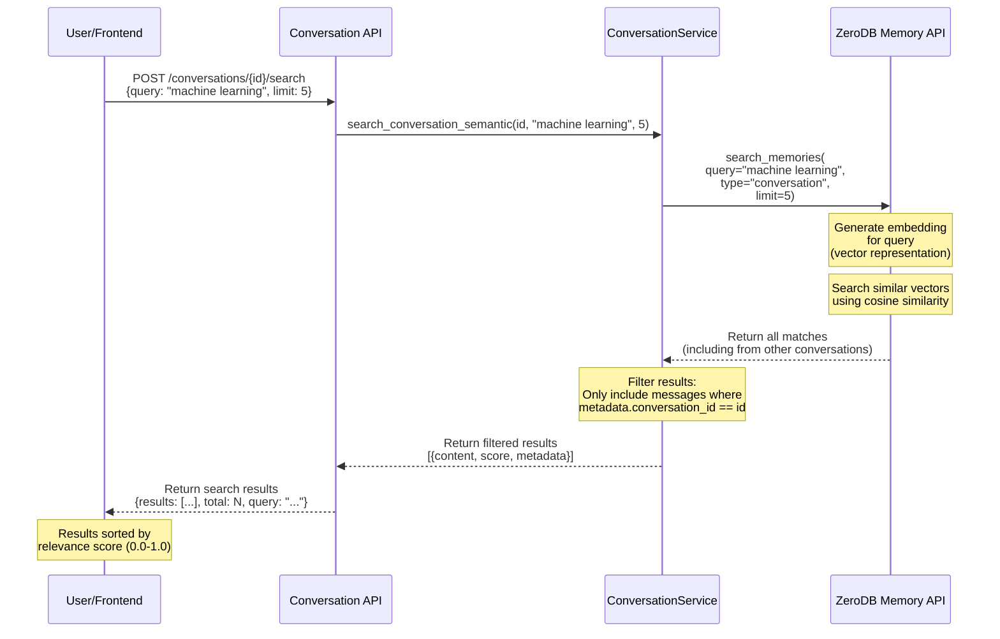

**Semantic Search Features**:

- **Vector Embeddings**: Messages automatically embedded on creation
- **Similarity Search**: Find messages by meaning, not keywords
- **Conversation Filtering**: Results isolated to single conversation
- **Relevance Scoring**: Results ranked by similarity (0.0-1.0)

**Use Cases**:
- Find previous discussion on a topic
- Locate specific information from long conversations
- Context retrieval for agent reasoning
- User asks "What did we discuss about X?"

---

## Workspace Isolation Architecture

This diagram shows how workspace isolation is enforced.

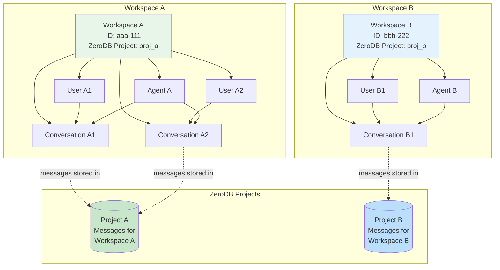

**Isolation Guarantees**:

1. **Database Level**: All queries filter by `workspace_id`
2. **ZeroDB Level**: Each workspace has separate project
3. **Cascade Deletes**: Deleting workspace removes all child entities
4. **Foreign Key Constraints**: Enforce referential integrity

**Query Pattern**:
```python
# All queries must filter by workspace_id
conversations = await db.execute(
    select(Conversation)
    .where(Conversation.workspace_id == workspace_id)
)
```

---

## Performance Optimization Architecture

This diagram shows performance optimization strategies.

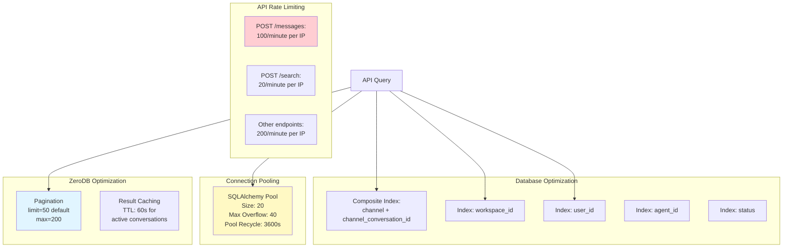

**Performance Targets**:

- **Message Retrieval**: < 200ms for 50 messages
- **Conversation List**: < 300ms for 50 conversations
- **Message Creation**: < 500ms end-to-end (WhatsApp → ZeroDB)
- **Semantic Search**: < 1000ms for 5 results

---

## Deployment Architecture

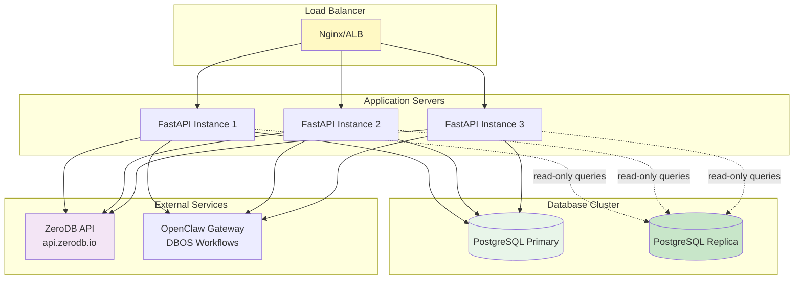

**Deployment Considerations**:

- **Horizontal Scaling**: Multiple FastAPI instances behind load balancer
- **Database Replication**: Read replicas for read-heavy workloads
- **Connection Pooling**: Shared connection pool across instances
- **Health Checks**: `/health` endpoint for load balancer probes
- **Graceful Shutdown**: Drain connections before instance termination

---

## Additional Resources

- **Main Documentation**: [docs/CHAT_PERSISTENCE.md](../CHAT_PERSISTENCE.md)
- **API Reference**: [docs/api/CONVERSATION_API.md](../api/CONVERSATION_API.md)
- **Troubleshooting**: [docs/CHAT_PERSISTENCE_TROUBLESHOOTING.md](../CHAT_PERSISTENCE_TROUBLESHOOTING.md)

---

**Document Version**: 1.0
**Last Updated**: 2026-03-08
